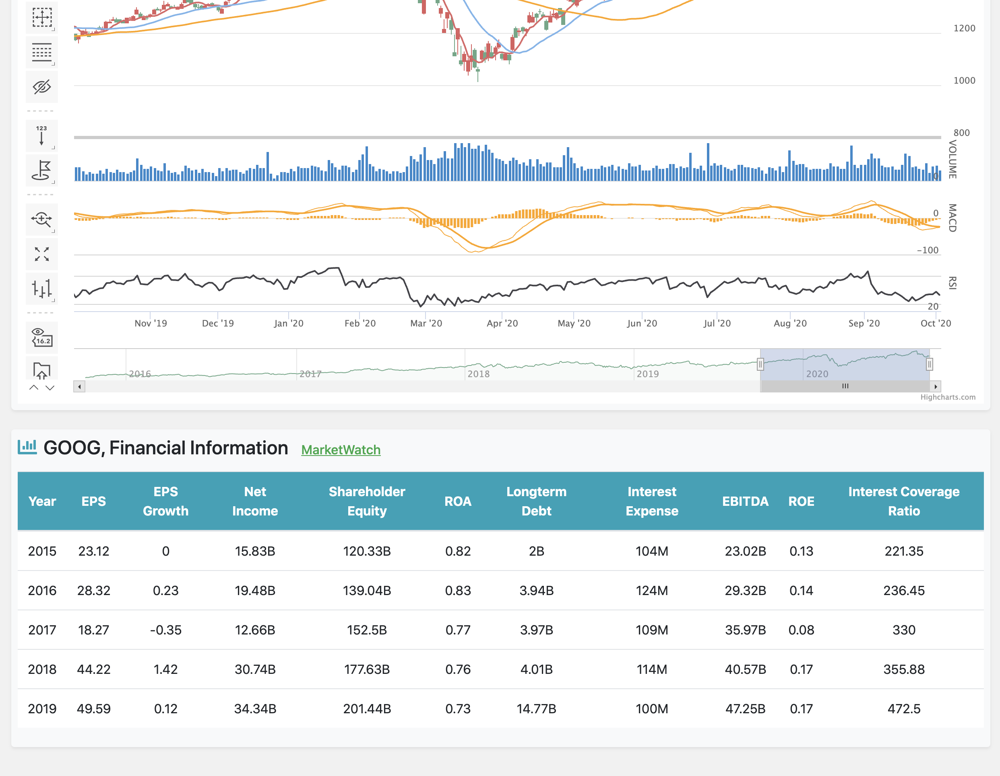

## Stock Investment Dashboard, using python 
---

### Go to [ demo site ](https://stock-dashboard-c2s6b2cyea-de.a.run.app)

### Purpose and Idea

This project is originally for practice purpose , in order to learn how to build web application in Python way after finished some Deep Learning courses with Jupyter Notebook. 
I found Vincent's blog about using python to build investment tool which could analyze and predict stock's reasonable price based on predicted future value. I am interest in investment. It's a good choice for practice project. 

After first version is finished by reference to Vincent's project ( You can go to [Vincent Tatan's blog and GitHub project ](https://towardsdatascience.com/value-investing-dashboard-with-python-beautiful-soup-and-dash-python-43002f6a97ca) to get more information  ) ,  I use this project to do more practices , change framework , redesign page content, and make this application appear a new style.  You can go to [ demo site ](https://stock-dashboard-c2s6b2cyea-de.a.run.app) and have a look.

This application implement simple model to predict expected stock price. For example, annual growth of EPS is calculated by average 1st and 5th yeas' EPS. It's unreliable assumption. In demo site, you'll find most price prediction are different from real market behavior. This model alone is not enough.  So, don't use this application in real market decision !

Some experts have developed models to solve financial market challenges, like the true story in this book ["The Man Who Solved the Market"](https://www.amazon.com/Man-Who-Solved-Market-Revolution/dp/073521798X) , but no tech detail are covered in that book. Hope there are more direct resources to learn how to build such system. 

Now, this application can show stock K chart, MACD, RSI ... , critical financial indicators, link to Yahoo financial , MarketWath web site, let you self study more information about the stock which you would like to invest in.  

---
## Warning : ##
This application has not been rigorously tested and its domain rules are very simple which are hard to cover the complexity of real stock market. There may be also incorrect data introduced by some not found bugs or data sources .
### This application is not mature enough and risky to be your decision tool in real stock market !

-------

### Screenshots : 

-------

### Develop tools and main packages  
1. Visual Studio Code
2. Python 3.8
3. pipenv
4. Web framework :  from Dash migrate to Django
5. Django Rest Framework
6. Stock chart :  from cufflinks.quant_figure change to HighCharts Stock
7. jQuery : through ajax update information and stock chart
8. pandas datareader : to get stock price histor 
9. BeautifulSoup : parsing web page
10. gunicorn for web server
11. dj-static for static file process in gunicorn 
12. Web UI apply Bootstrap 4.x and responsive
13. Fontawesome : icon
14. bootstrap-slider :  https://github.com/seiyria/bootstrap-slider
15. Ion.RangeSlider : http://ionden.com/a/plugins/ion.rangeSlider/index.html
    

## Run and Deploy
1. no requirement for database or storage
2. stock price and financial information are real time access from other web site or service , if data source web sites block request that will cause service error
3. Stock information will be cached in memory for 12 hr after first accessed
4. Demo site is deploy to Google Cloud Run, it may need more seconds to start application if it already auto shutdown after long idle. 
5. It may take more seconds to refresh stock information if it's the first usage of that stock in last 12 hours

 
### Run in development mode
1.  python manage.py runserver
  
### Run in gunicorn
1. python manage.py collectstatic  // this will copy css js image ... files to staticfiles folder
2. gunicorn --bind 0.0,0.0:change_to_prefered_port config.wsgi:application
   
### Deploy to Google Cloud Run
1. Apply Google Cloud Service account
2. install Google Cloud SDK for python, follow instruction on official document
3. install Google Cloud extend module for Visual Code
4. use Cloud Run to deploy application

### Run in Jupyter Notebook
1. In Jupyter Notebook, use jupyter-dash to wrap application and run in new browser. Need to install jupyter-dash to run.
2. dashboard.py is the app called in Jupyter notebook, it's 2nd version based on Dash

## Project status
- There are no plan to enhance more function in this project.
- There may be some bugs left unresolved.

