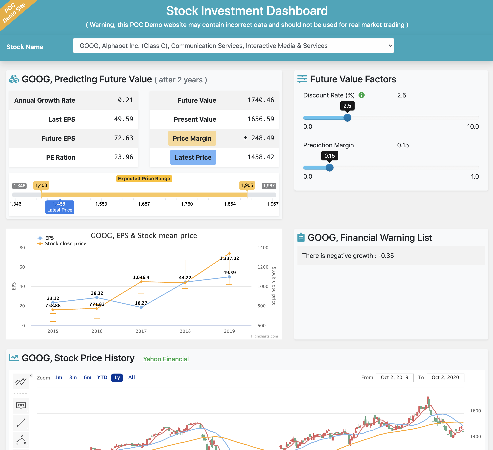

## Simple Value Investing Dashboard, using python 

Go head to [ demo site ](https://stock-dashboard-c2s6b2cyea-de.a.run.app)

This application , refer [Vincent Tatan's blog and project at GitHub ](https://towardsdatascience.com/value-investing-dashboard-with-python-beautiful-soup-and-dash-python-43002f6a97ca) , collect company's stock price history , financial summary information from professional financial website ( MarketWatch) and yahoo ( pandas' datareader) to do simple rule-based analysis then infer reasonable share price to give suggestion on sell or buy decision .

Value investment and technical analysis are two mainstream in stock market. To increase probability of winning , investors now should know more than that in this rapid change era . Maybe choose good funds to buy is better idea for general investors.  Even professional fund managers face big challenge to fast collecting and interpreting information for making good trading decision and quick enough before market change to another condition . Information system could help practitioners do their job easier. 

This application show how Python parsing web page and organize information with friendly tabular and chart web page offering a easy to use investment tool.  I have learned a lot through reading codes , developing new function and refactoring part of UI and code to another style . Thanks Vincent share his idea and project. 

Following are some changes I make from that project :
- Change UI layout and apply Bootstrap 4
- Direct run in Jupyter notebook
- Change share price graph to K chart , add SMA , MACD , RSI 
- File name are also changed and do some code refactoring
- Get data through API from stock market data company is more reliable and efficient than parsing web page from website , but this part left no modification.

.
It's fun and very useful to develop investment portfolio management or stock investment tools. The book ["The Man Who Solved the Market"](https://www.amazon.com/Man-Who-Solved-Market-Revolution/dp/073521798X)  tell the story about how the company , initial core members are lots of top PHD mathematicians , develop information system to beat financial market . The idea of Big Data and AI are already implemented to solve complicate and dynamic changing problem in that era . The book doesn't uncover technical detail, it's business secret . Many company still begin to use similar investment strategy and tool. Since Big Data and AI technology quickly spread to software community and industry. When more and more people and company know how to use that technology. Such system may soon be from unique superiority become basic ability of industries.  

.

## Warning : ##
This application has not been rigorously tested and its domain rules are very simple which are hard to cover the complexity of real stock market. There may be also wrong information introduced by some not found bugs.
## This application is not mature enough and risky to be your decision tool in real stock market !

-------

### Screenshots : 

Main process :

1. Get stock ticker and name to be data source of dropdown control
2. Get stock price history from yahoo through pandas datareader when user choose a stock from dropdown control
3. Plot stock k chart , sma  , macd , rsi lines
4. Get stock financial information from financial website to do basic analysis and infer future value for trading decision.

.

You can refer [Vincent Tatan's blog ](https://towardsdatascience.com/value-investing-dashboard-with-python-beautiful-soup-and-dash-python-43002f6a97ca) to learn complete explanation.